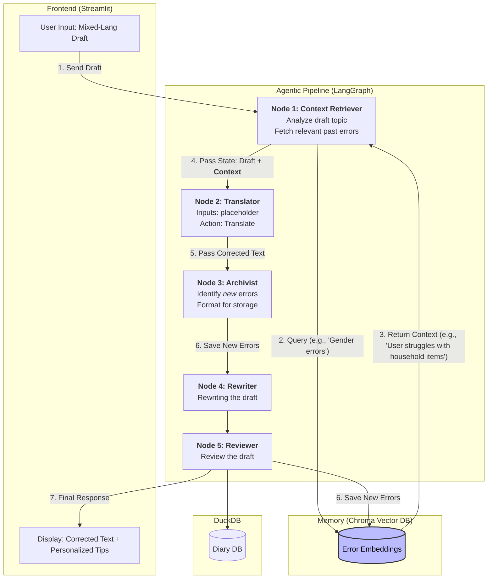

# LangDiaryAgentic

This project provides AI language learning assistance.

[](https://kensuke-mitsuzawa.github.io/portfolio/LangDiaryAgentic.mp4)


## Background

Writing diaries is supposed to be an effective methods to learn a language, especially the mid-level to the advanced language learner.

The language learner often encounter troubles in finding expressions and vocabularies that they want to express.
Looking up correct expressions are time-consuming and painful works.
This can be one of reasons that language learners give up writing diaries.

## Solution

This project help writing diaries with an expression in the language that the learner is familiar with.

For example, "Je suis [a girl]. J'ai [13 years old]". for french-learner whose native language is English.

# Main features

- AI suggestions of improving the vocabularies and expressions. 
- Keeping the diary and errors in the past.


# Technical description

Agentic LLM system is in charge of translating, grammar checker, and rewriting.
To reflect user's errors in past, RAG is used to suggest grammatical reviews.

System deployment can be done all locally.
No concern of security matters.

## Tech Stack

- AIs: LangChain, HuggingFace
- WepAPI: fastapi, streamlit
- DBs: ChromaDB, DuckDB


# Prerequisites

- Python: 3.12+
- Package Manager: uv
- Hardware: NVIDIA GPU with CUDA support (Recommended: [e.g., 24GB+] VRAM). Confirmed to work with CUDA 12.9 on 2 V100S-PCIE-32GB GPUs.
- OS: Linux.


# Installation & Setup

```
1. Environment Setup
This project uses uv for fast dependency management.

# Install uv if not already installed
pip install uv

# Sync dependencies and create virtual environment (default: .venv)
uv sync

# Activate the environment
source .venv/bin/activate
```

##  API Keys & LLM Access

These descriptions below are applied in the followig cases,
1. want to use the LLMs that requires the accepting "terms" on the HuggingFace (such as Mistral or Llama),
2. want to change the storage path where the `transformers` package saves the model file.


Create an Access Token (Read permission) in your HF settings. Create a .env file in the project root:

```
HF_TOKEN='[your_huggingface_token_here]'

# Optional: Custom model cache location (default is ~/.cache)
# HF_HOME='/abs/path/to/large/storage'
```

## Configuration

The app configurations are found at `lang_diary_agentic/configs.py`.


# System Architecture





# Deployments

## LLM service

There are two choices: `local` or `server`.
Please switch the mode at `lang_diary_agentic/configs.py`.

### Local mode

Nothing special configuration is necessary.
Yet, the local machine must be equipped with GPUs.

### Server mode

1. `git clone` this project on the machine equipped with GPU devices.
2. setting up this project using `nv` command.
3. launching the API service with the following command,

```
# suppose at `./servers/
uvicorn server:app --host 0.0.0.0 --port 8000
```


## Web App

### Configurations

Check the configurations `lang_diary_agentic/configs.py`.

### Web App service

A Web GUI to write the diary entries.

```
streamlit run ui/data_input_viewer.py
```

A Web GUI to view the diary entries.

```
streamlit run ui/data_viewer.py
```

